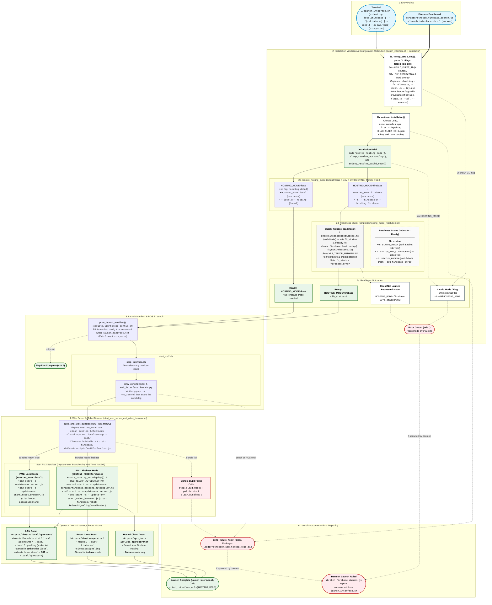

```mermaid
flowchart TD
    %% ================= STYLING =================
    classDef entry fill:#e1f5fe,stroke:#0288d1,stroke-width:2px,color:#000
    classDef success fill:#e8f5e9,stroke:#2e7d32,stroke-width:2px,color:#000
    classDef warn fill:#fff8e1,stroke:#f57f17,stroke-width:2px,color:#000
    classDef error fill:#ffebee,stroke:#c62828,stroke-width:2px,color:#000
    classDef check fill:#f5f5f5,stroke:#616161,stroke-width:1.5px,color:#000
    classDef rule fill:#ffffff,stroke:#455a64,stroke-width:1.5px,color:#000
    classDef legend fill:#fafafa,stroke:#9e9e9e,stroke-width:1px,stroke-dasharray: 4 4,color:#000

    %% ================= 1. ENTRY POINTS =================
    subgraph ENTRY["1. Entry Points"]
        term(["<b>Terminal</b><br/><code>./launch_interface.sh [--hosting [local|firebase]] [-f|--firebase] [--local] [-m map.yaml] [--dry-run]</code>"]):::entry
        dash(["<b>Firebase Dashboard</b><br/><code>scripts/stretch_firebase_daemon.js</code><br/><code>./launch_interface.sh -f [-m map]</code>"]):::entry
    end

    %% ================= 2. HOSTING MODE RESOLUTION =================
    subgraph RESOLUTION["2. Installation Validation &amp; Configuration Resolution (launch_interface.sh + scripts/lib/)"]

        argp["<b>2a. teleop_setup_env(), parse CLI flags, teleop_log_dir()</b><br/>Sets <code>HELLO_FLEET_ID</code> (+ source), <code>RMW_IMPLEMENTATION</code> &amp; ROS overlay<br/>Captures <code>--hosting</code>, <code>-f/--firebase</code>, <code>--local</code>, <code>-m</code>, <code>--dry-run</code><br/>Prints feature flags with provenance (<code>feature-flags.js --all --sources</code>)"]:::rule

        vi["<b>2b. validate_installation()</b><br/>Checks <code>.env</code>, <code>node_modules</code>, <code>npm list --depth=0</code>,<br/><code>HELLO_FLEET_ID+6.pem</code> &amp; key, and <code>.env</code> cert/key"]:::rule

        vi_pass["<b>Installation Valid</b><br/>Calls <code>resolve_hosting_mode()</code>, <code>teleop_resolve_autodeploy()</code>,<br/>and <code>teleop_resolve_build_mode()</code>"]:::success

        subgraph ARGS["2c. resolve_hosting_mode (default=local &lt; .env &lt; env:HOSTING_MODE &lt; CLI)"]
            t_loc["<b>HOSTING_MODE=local</b><br/>• no flag, no setting (default)<br/>• <code>HOSTING_MODE=local</code> (.env or env)<br/>• <code>--local</code> or <code>--hosting [local]</code>"]
            t_fire["<b>HOSTING_MODE=firebase</b><br/>• <code>HOSTING_MODE=firebase</code> (.env or env)<br/>• <code>-f, --firebase</code> or <code>--hosting firebase</code>"]
        end

        subgraph CHECKS["2d. Readiness Check (scripts/lib/hosting_mode_resolution.sh)"]
            fp["<b>check_firebase_readiness()</b><br/>1. <code>checkFirebaseRobotAccess.js</code> (auth &amp; role) → sets <code>fb_status</code><br/>2. If ready (0): <code>check_firebase_host_setup()</code> (<code>syncFirebaseRc.js</code>)<br/>clears <code>WEB_TELEOP_AUTODEPLOY</code> to <code>0</code> on failure &amp; checks daemon<br/>Sets: <code>fb_status</code>, <code>firebase_error</code>"]:::check

            status_tbl["<b>Readiness Status Codes (0 = Ready)</b><br/>────────────────────────<br/><b><code>fb_status</code></b><br/>• <code>0</code> : <code>STATUS_READY</code> (auth &amp; robot role valid)<br/>• <code>2</code> : <code>STATUS_NOT_CONFIGURED</code> (not set up yet)<br/>• <code>3</code> : <code>STATUS_BROKEN</code> (auth failed / crash — sets <code>firebase_error</code>)"]:::legend
        end

        subgraph RULES["2e. Readiness Outcomes"]
            r_loc["<b>Ready: HOSTING_MODE=local</b><br/>• No Firebase probe needed"]:::success
            r_fire["<b>Ready: HOSTING_MODE=firebase</b><br/>• <code>fb_status=0</code>"]:::success
            r_inv["<b>Invalid Mode / Flag</b><br/>• Unknown CLI flag<br/>• Invalid <code>HOSTING_MODE</code>"]:::rule
            r_err["<b>Could Not Launch Requested Mode</b><br/>• <code>HOSTING_MODE=firebase</code> &amp; <code>fb_status=2|3</code><br/>"]:::rule
        end

        resfail(["<b>Error Output (exit 1)</b><br/>Prints mode error &amp; exits"]):::error

    end

    %% Step 2 Connections
    r_loc --> manifest
    r_fire --> manifest
    term --> argp
    dash ===> argp
    argp --> vi
    argp -.->|"unknown CLI flag"| r_inv
    vi --> vi_pass
    vi -.-> fail

    vi_pass --> t_loc & t_fire
    vi_pass -.->|"bad HOSTING_MODE"| r_inv

    t_loc --> r_loc
    t_fire --> fp

    %% Anchor status_tbl to the same rank as fp so CHECKS stays compact
    t_fire ~~~ status_tbl
    status_tbl ~~~ r_err

    fp --> r_fire & r_err

    r_inv & r_err -.-> resfail

    %% ================= 3. MANIFEST & ROS 2 =================
    subgraph CORE["3. Launch Manifest &amp; ROS 2 Launch"]
        manifest["<b>print_launch_manifest()</b> (<code>scripts/lib/teleop_config.sh</code>)<br/>Prints resolved config + provenance &amp; writes <code>launch_manifest.txt</code><br/>(Exits 0 here if <code>--dry-run</code>)"]
        dry(["<b>Dry-Run Complete (exit 0)</b>"]):::success

        subgraph ROS2["start_ros2.sh"]
            stop["<b>stop_interface.sh</b><br/>Tears down any previous stack"]
            ros["<b>rmw_zenohd</b> router &amp; <b><code>web_interface.launch.py</code></b><br/>Verifies <code>pgrep -x rmw_zenohd</code>, then scans the launch log"]
        end
    end

    manifest -.->|"--dry-run"| dry
    manifest --> stop --> ros

    %% ================= 4. WEB SERVER & BUNDLES =================
    subgraph WEB["4. Web Server &amp; Robot Browser (start_web_server_and_robot_browser.sh)"]
        bld["<b>build_and_wait_bundles(HOSTING_MODE)</b><br/>Exports <code>HOSTING_MODE</code>, runs <code>clear_bundles()</code>, then builds:<br/>• <code>local</code>: <code>npm run localstorage</code> → <code>dist/</code><br/>• <code>firebase</code>: builds <code>dist/</code> + <code>dist-firebase/</code><br/>Verifies via <code>scripts/waitForBundles.js</code>"]

        bfail["<b>Bundle Build Failed</b><br/>Calls <code>stop_cloud_mode()</code>: <code>pm2 delete</code> &amp; <code>clear_bundles()</code>"]:::error

        subgraph PM2["Start PM2 Services (--update-env, Branches by HOSTING_MODE)"]
            pm2_loc["<b>PM2: Local Mode (<code>HOSTING_MODE=local</code>)</b><br/>• <code>pm2 start -s --update-env server.js</code><br/>• <code>pm2 start -s --update-env start_robot_browser.js</code> (<code>dist/robot</code>: <code>LocalSignaling</code>)"]:::success
            pm2_fire["<b>PM2: Firebase Mode (<code>HOSTING_MODE=firebase</code>)</b><br/>• <code>start_hosting_autodeploy()</code>: if <code>WEB_TELEOP_AUTODEPLOY!=0</code>,<br/>runs <code>pm2 start -s --update-env scripts/firebase_hosting_autodeploy.js</code><br/>• <code>pm2 start -s --update-env server.js</code><br/>• <code>pm2 start -s --update-env start_robot_browser.js</code> (<code>dist-firebase/robot</code>: <code>TeleopSignalingCoordinator</code>)"]:::success
        end
    end

    ros --> bld
    bld -->|"bundles ready: local"| pm2_loc
    bld -->|"bundles ready: firebase"| pm2_fire
    bld -.->|"bundle fail"| bfail

    %% ================= 5. OPERATOR DOORS & ROUTES =================
    subgraph DOORS["5. Operator Doors &amp; server.js Route Mounts"]
        d_lan["<b>LAN Door: <code>https://&lt;host&gt;/local/operator/</code></b><br/>• Mounts <code>/local/</code> → <code>dist/</code> (<code>local</code> also mounts <code>/</code> → <code>dist/</code>)<br/>• <code>LocalSignaling</code> (socket.io)<br/>• Served in <b>both</b> modes (<code>local</code> redirects <code>/operator/</code> → <b>302</b> → <code>/local/operator/</code>)"]:::success
        d_cloud["<b>Robot Cloud Door: <code>https://&lt;host&gt;/operator/</code></b><br/>• Mounts <code>/</code> → <code>dist-firebase/</code><br/>• <code>FirebaseSignaling</code><br/>• Served in <b>firebase</b> mode"]:::success
        d_host["<b>Hosted Cloud Door: <code>https://&lt;project-id&gt;.web.app/operator</code></b><br/>• Served from Firebase Hosting<br/>• <b>firebase</b> mode only"]:::success
    end

    pm2_loc --> d_lan
    pm2_fire --> d_lan & d_cloud & d_host

    %% ================= 6. OUTCOMES & EXIT HANDLERS =================
    subgraph OUTCOMES["6. Launch Outcomes &amp; Error Reporting"]
        back(["<b>Launch Complete (launch_interface.sh)</b><br/>Calls <code>print_interface_urls(HOSTING_MODE)</code>"]):::success
        fail(["<b>echo_failure_help() (exit 1)</b><br/>Packages <code>logdir/stretch4_web_teleop_logs.zip</code>"]):::error
        dfail(["<b>Daemon Launch Failed</b><br/><code>stretch_firebase_daemon.js</code> reports<br/>non-zero exit from <code>launch_interface.sh</code>"]):::error
    end

    ros -.->|"zenoh or ROS error"| fail
    bfail -.-> fail
    resfail -.->|"if spawned by daemon"| dfail
    fail -.->|"if spawned by daemon"| dfail
    d_lan & d_cloud & d_host --> back
```
