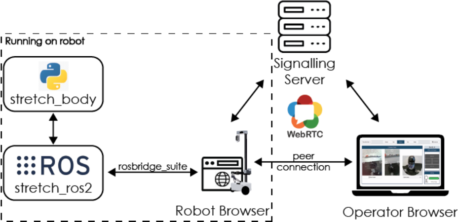
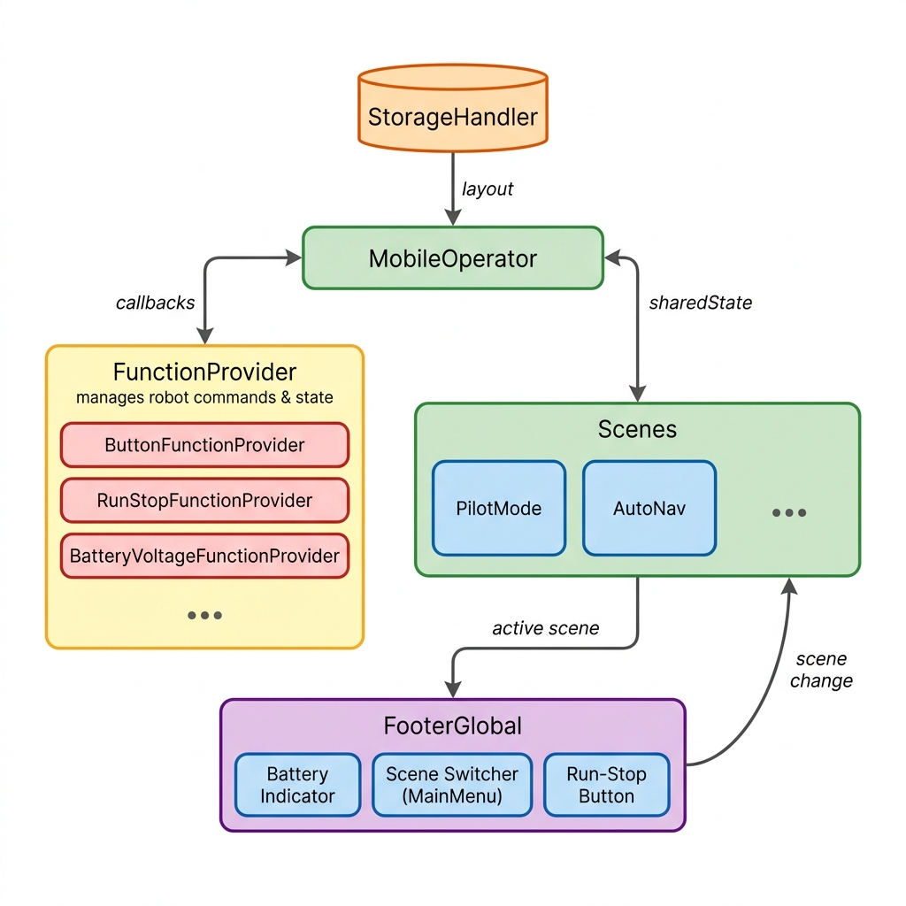

# Software Architecture

Stretch Web Teleop utilizes `ROS2`, `WebRTC` (web real-time communication), `NodeJS`, and `TypeScript`. The system runs in a headless browser onboard the robot. The robot browser has access to the robot via `ROS2`, however, the operator can only send commands or receive information indirectly through the robot browser. We utilize WebRTC to establish a peer connection between the operator browser, which loads the interface, and the robot browser. The robot browser uses `rosbridge` to connect to the robot via `ROS2`. `rosbridge` translates `JSON` messages from the robot browser to `ROS2` messages and vice versa.

When the interface is launched on the robot, the `ROS2` drivers and the robot browser are launched. The robot browser creates and joins a `WebSocket` room and waits for an operator to join. In a browser, the user can either go to an IP address when on the same network as the robot or a URL when accessing it remotely. We recommend using `Ngrok` to establish a secure tunnel over the internet for remote use (see instructions here). When the user navigates to the IP address or URL, the operator browser joins the `WebSocket` room created by the robot browser and a peer connection is established.

> **_NOTE:_** Only one peer connection between the operator and robot browser can be established. If another operator attempts to open the interface, the connection will be rejected.

Once a peer connection is established, the interface will render the default layout (see [render logic flow](#render-logic-flow) for more details) on the operator browser and the user will be able to control the robot.

For example, assume the user clicks a button to drive the robot forward, the command is sent to the robot browser. This command is passed through rosbridge which translates the `JSON` message into a `ROS2` message. The robot browser can also send information, such as joint limits and collision information, to the operator browser. When the user closes the browser, the peer connection is disconnected and another user can connect to the interface.

## Render Logic Flow

The `StorageHandler` persists and retrieves the operator's `layout` — including action mode, speed, and pilot controls — and passes it to `MobileOperator` on startup. `MobileOperator` is the root React component and manages all top-level state (button collisions, camera selection, velocity scale, active scene, etc.). It initializes a set of **Function Providers** (e.g. `ButtonFunctionProvider`, `RunStopFunctionProvider`, `BatteryVoltageFunctionProvider`) that abstract the communication layer between UI components and the remote robot, exposing functions and firing callbacks back into `MobileOperator` when robot state changes.

`MobileOperator` renders a **Scenes** container that holds the currently active scene alongside `FooterGlobal`. Each scene (currently `PilotMode` and `AutoNav`) is a self-contained view: `PilotMode` hosts the overhead camera, drive controls, movement recorder, and gripper picture-in-picture, while `AutoNav` hosts the occupancy-grid map and autonomous navigation controls. `FooterGlobal` is always visible and provides the **Scene Switcher** (via `MainMenu`) to transition between scenes, a **Battery Indicator**, and the **Run-Stop** button.
